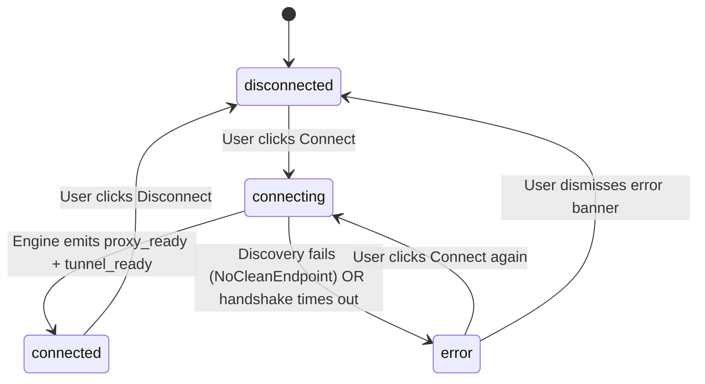

# Data Model: Endpoint Discovery Failure State and Unified Noise Profiles

## Entities

### 1. ConnectionState

Represents the state machine governing the desktop and mobile user interface.

| Field | Type | Description |
|---|---|---|
| `status` | `Status` (`disconnected` \| `connecting` \| `connected` \| `error`) | High-level lifecycle phase |
| `detail` | `String` | Diagnostic or descriptive label displayed in UI |
| `pid` | `Option<u32>` | OS process identifier of running engine binary |
| `endpoint` | `Option<String>` | Selected edge IP and port (e.g. `162.159.193.10:443`) |

**State Transitions**:


**Key Invariant**:
- When `status` transitions to `error` or `disconnected`, `running` MUST evaluate to `false` so the power button reverts to the idle "CONNECT" state.

---

### 2. ObfuscationProfile (NoiseConfig / AetherNoizeConfig)

Defines the pre-handshake junk injection parameters used by the engine.

| Field | Type | Default Value | Description |
|---|---|---|---|
| `jc` | `usize` | `5` | Total count of junk packets dispatched |
| `jmin` | `usize` | `50` | Minimum junk payload size in bytes |
| `jmax` | `usize` | `128` | Maximum junk payload size in bytes |
| `interval_ms` | `u64` | `0` | Delay between consecutive junk packets |
| `handshake_delay_ms` | `u64` | `0` | Delay between last junk packet and protocol handshake |

**Validation Rules**:
- `jmin >= 1` and `jmax >= jmin`
- `jmax <= 1280` (guaranteed below minimum path MTU to prevent packet fragmentation)
- `jc <= 64`

---

### 3. AmneziaWG Interface Header

Parameters embedded in the client WireGuard interface configuration conforming to AmneziaWG specifications.

| Header Key | Type | Value | Location |
|---|---|---|---|
| `Jc` | Integer | `5` | Below `PrivateKey` in `[Interface]` section |
| `Jmin` | Integer | `50` | Below `Jc` |
| `Jmax` | Integer | `128` | Below `Jmin` |

Example representation:
```ini
[Interface]
PrivateKey = <Base64-Key>
Address = 172.16.0.2/32
DNS = 1.1.1.1
Jc = 5
Jmin = 50
Jmax = 128

[Peer]
PublicKey = <Base64-Key>
Endpoint = 162.159.193.1:2408
AllowedIPs = 0.0.0.0/0
```

---

### 4. V2RayN Finalmask Noise Structure

JSON object structure for UDP noise generation matching v2rayN finalmask format.

```json
{
  "udp": [
    {
      "type": "noise",
      "settings": {
        "reset": "1-2",
        "noise": [
          { "rand": "50-128", "delay": "0" },
          { "rand": "50-128", "delay": "0" },
          { "rand": "50-128", "delay": "0" },
          { "rand": "50-128", "delay": "0" },
          { "rand": "50-128", "delay": "0" }
        ]
      }
    }
  ]
}
```

---

### 5. Structured Engine Events (`SessionEvent`)

Events transmitted over engine STDOUT as newline-delimited JSON (`AETHER_EVENT {...}`).

| Event Type | Payload Fields | Trigger Condition | UI Consequence |
|---|---|---|---|
| `endpoint_selected` | `addr`, `protocol` | Working gateway candidate selected | Updates endpoint display |
| `proxy_ready` | `socks`, `http` | SOCKS5 & HTTP listeners bound | Marks proxy subsystem ready |
| `tunnel_ready` | `transport` | Crypto tunnel verified | Marks tunnel subsystem ready |
| `connected` | `detail` | Both subsystems active | Sets status to `connected` |
| `error` | `message` | Scan failed or unrecoverable error | Sets status to `error`, reverts button |
