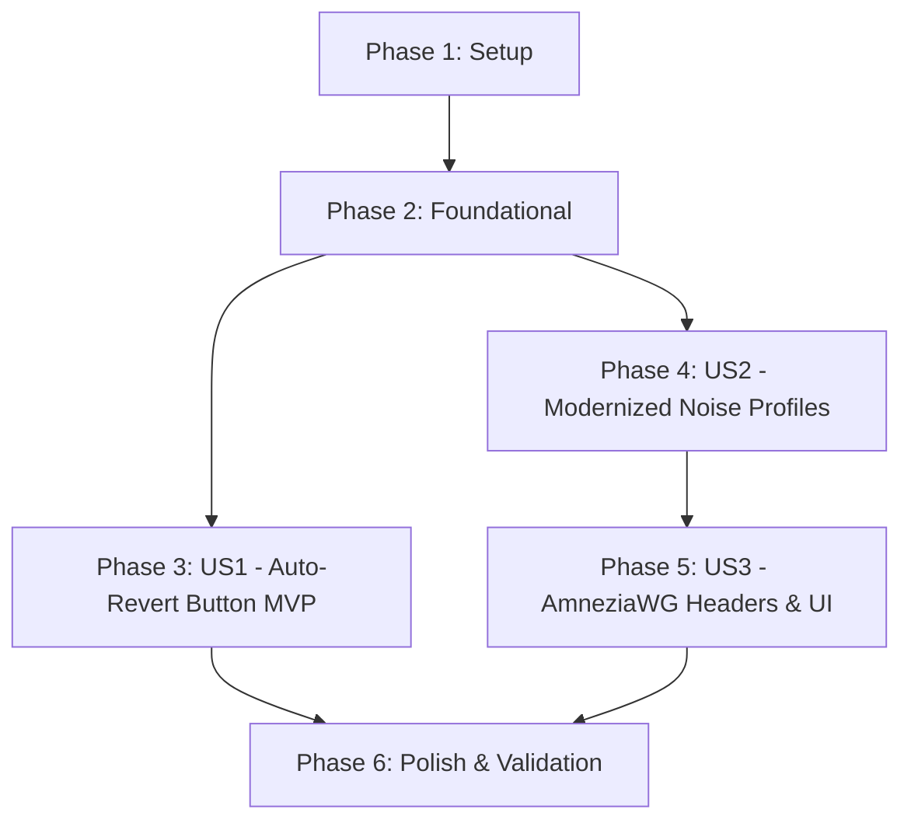

# Tasks: Reset Connect State on Discovery Failure and Modernize Noise Profiles

**Feature Branch**: `001-fix-scan-fail-noise`  
**Input**: Design artifacts from `specs/001-fix-scan-fail-noise/` (`spec.md`, `plan.md`, `data-model.md`, `contracts/`, `research.md`, `quickstart.md`)

## Phase 1: Setup (Shared Infrastructure)

**Purpose**: Baseline verification of toolchains and existing test suites before code modifications.

- [X] T001 Inspect and verify engine build integrity via `cargo check` in `aether/Cargo.toml`
- [X] T002 [P] Verify existing unit test baseline by running `cargo test` in `aether/`

---

## Phase 2: Foundational (Blocking Prerequisites)

**Purpose**: Core engine process termination and structured error flushing that blocks all user stories.

- [X] T003 Ensure unbuffered immediate standard output flushing for `SessionEvent::Error` in `aether/src/session_event.rs`
- [X] T004 Implement explicit exit via `std::process::exit(1)` on session error in `aether/src/main.rs` to bypass Tokio runtime drop hanging on Windows stdin blocking reads

**Checkpoint**: Core engine failure path can exit cleanly without hanging OS threads.

---

## Phase 3: User Story 1 - Auto-Revert Connect Button on Endpoint Discovery Failure (Priority: P1) 🎯 MVP

**Goal**: When endpoint scanning (notably on MASQUE H3) finds no valid gateways, terminate the attempt immediately, emit a structured error, and automatically reset the UI Start/Connect button to the idle state.

**Independent Test**: Launch application, select MASQUE H3 preset, initiate connection with unreachable or blocked endpoints, and verify that the power button immediately reverts to "CONNECT" upon scan failure without manual button disengagement.

### Implementation for User Story 1

- [X] T005 [US1] Remove dead anycast fallback (`MASQUE_H3_ENDPOINT`) on MASQUE H3 scan failure in `aether/src/session.rs` so `AetherError::NoCleanEndpoint` propagates immediately
- [X] T006 [US1] Update engine event stream parser and process supervision in `apps/desktop/src-tauri/src/lib.rs` to transition runtime state to `"error"`, set `connecting` to false, and release proxy locks upon error event or non-zero child exit
- [X] T007 [P] [US1] Update Android engine bridge in `apps/android/android/app/src/main/java/app/aethernext/SessionController.kt` to transition state to `"error"` and tear down foreground services upon error event or non-zero exit
- [X] T008 [P] [US1] Verify runtime hook logic in `apps/desktop/src/hooks/useRuntime.ts` and `apps/desktop/src/components/ConnectionTab.tsx` ensuring `running` resolves to `false` when status is `"error"`, instantly resetting the Connect power button

**Checkpoint**: User Story 1 complete. Failed scans immediately reset the Start button to "CONNECT" across desktop and mobile.

---

## Phase 4: User Story 2 - Modernized Noise Profiles Across All Supported Protocols (Priority: P1)

**Goal**: Replace existing legacy noise parameters across WireGuard, WARP-in-WARP (Gool), MASQUE H2, and MASQUE H3 with the proven anti-DPI profile (`Jc=5`, `Jmin=50`, `Jmax=128`, `0ms` delay).

**Independent Test**: Connect using each of the four protocol modes and verify that 5 pre-handshake junk packets within the 50–128 byte range are dispatched with 0ms inter-packet delay.

### Implementation for User Story 2

- [X] T009 [US2] Update MASQUE pre-handshake noise configuration in `aether/src/noize.rs` (`firewall`, `gfw` profiles) to `jc_before_hs: 5`, `jmin: 50`, `jmax: 128`, and `junk_interval: Duration::ZERO`
- [X] T010 [US2] Update WireGuard and WARP-in-WARP pre-handshake obfuscator in `aether/src/aethernoize.rs` to dispatch 5 junk packets sized in `[50, 128]` with zero inter-packet delay (`junk_interval: Duration::ZERO`, `handshake_delay: Duration::ZERO`)
- [X] T011 [US2] Update unified obfuscation profile mappings and environment variable defaults in `aether/src/obfuscation.rs` to reflect `Jc=5`, `Jmin=50`, `Jmax=128`, and `0ms` interval
- [X] T012 [P] [US2] Update default settings struct in `apps/desktop/src-tauri/src/lib.rs` to default `noize_jc: 5`, `noize_jmin: 50`, `noize_jmax: 128`, and `noize_interval_ms: 0`
- [X] T013 [P] [US2] Update desktop settings model defaults in `apps/desktop/src/types.ts` to `noizeJc: 5`, `noizeJmin: 50`, `noizeJmax: 128`, and `noizeIntervalMs: 0`
- [X] T014 [P] [US2] Update Android settings model defaults in `apps/android/src/types.ts` to `noizeJc: 5`, `noizeJmin: 50`, `noizeJmax: 128`, and `noizeIntervalMs: 0`

**Checkpoint**: User Story 2 complete. All four protocols now inject the unified 5-packet burst of 50–128 byte noise datagrams with 0ms delay.

---

## Phase 5: User Story 3 - WireGuard Amnezia and Finalmask Noise Compatibility (Priority: P2)

**Goal**: Support Amnezia WireGuard noise headers (`Jc=5`, `Jmin=50`, `Jmax=128` under the private key part) and format custom obfuscation UI fields around the new standard.

**Independent Test**: Inspect generated WireGuard configuration files and verify custom obfuscation controls in the Settings UI default to Jc=5, Jmin=50, Jmax=128, 0ms.

### Implementation for User Story 3

- [X] T015 [US3] Add AmneziaWG configuration formatting (`Jc = 5`, `Jmin = 50`, `Jmax = 128` under `[Interface]`) in `aether/src/config.rs` when exporting or serializing WireGuard profiles
- [X] T016 [P] [US3] Update custom obfuscation controls and validation in `apps/desktop/src/components/SettingsTab.tsx` and `apps/desktop/src-tauri/src/lib.rs` to validate `Jmin >= 1`, `Jmax >= Jmin`, and default to 5, 50, 128, 0

**Checkpoint**: User Story 3 complete. Amnezia headers and custom settings UI are fully aligned with the 50–128 byte, 5-packet format.

---

## Phase 6: Polish & Cross-Cutting Concerns

**Purpose**: Verification, unit testing, and full regression testing across stories.

- [X] T017 [P] Add unit tests in `aether/src/noize.rs` and `aether/src/aethernoize.rs` verifying packet count, size bounds, and zero-delay timing
- [X] T018 Execute validation scenarios defined in `specs/001-fix-scan-fail-noise/quickstart.md` confirming button auto-reversion and zero orphaned processes

---

## Dependencies & Execution Order

### Phase Dependencies

### User Story Dependencies
- **User Story 1 (P1)**: Depends on Phase 2 (Foundational exit fix). Can be completed and validated independently as MVP.
- **User Story 2 (P1)**: Depends on Phase 2. Can be implemented in parallel with US1.
- **User Story 3 (P2)**: Builds upon the parameters established in US2.

### Parallel Opportunities
- In Phase 3: `T007` (Android bridge) and `T008` (Desktop UI hook) can run in parallel with `T006` (Tauri backend).
- In Phase 4: `T012`, `T013`, and `T014` (Settings defaults across Tauri, Desktop, and Android) can run in parallel.
- In Phase 5: `T016` (SettingsTab UI) can run in parallel with `T015` (Rust config serialization).
- In Phase 6: `T017` (Unit tests) can run in parallel with documentation checks.

---

## Implementation Strategy

### MVP First (User Story 1)
1. Complete Setup (T001, T002) and Foundational (T003, T004).
2. Complete User Story 1 (T005, T006, T007, T008).
3. Validate that a failed scan cleanly and immediately reverts the Start button to "CONNECT".
4. Deliver MVP fix.

### Incremental Delivery
1. Add User Story 2 (T009–T014) to activate the 5-packet, 50–128 byte noise burst across all 4 protocols.
2. Add User Story 3 (T015, T016) for AmneziaWG headers and custom settings UI controls.
3. Complete Phase 6 (T017, T018) for regression testing and quickstart validation.
