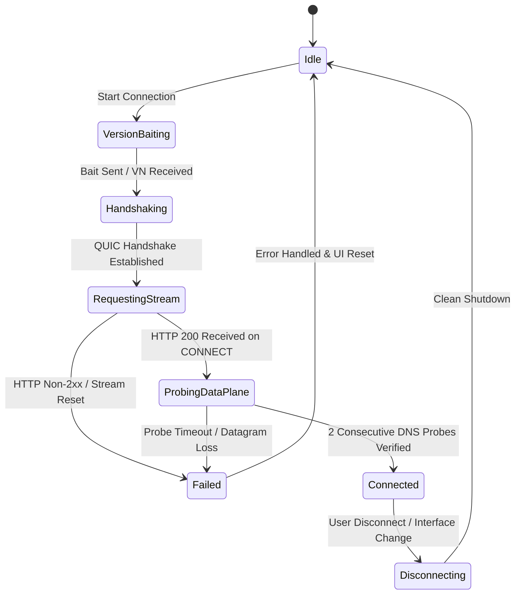

# Phase 1 Data Model: MASQUE H3 Protocol & State Entities

**Feature**: Fix MASQUE H3 Connectivity and Upstream Alignment + Visual & Functional Bugs
**Status**: Completed

---

## 1. Core Engine Entities (Rust)

### `QuicVersionBaitPacket`
Represents the pre-handshake 1200-byte UDP datagram crafted to elicit RFC 9000 Version Negotiation from middleboxes/edges.

| Field | Type | Description |
|---|---|---|
| `header` | `u8` | `0xc3` (Long Header, fixed bit 1, Initial packet for QUIC v2) |
| `version` | `u32` | `0x6b33_43cf` (QUIC v2 draft version identifier) |
| `dcid_len` | `u8` | `8` bytes |
| `dcid` | `[u8; 8]` | Cryptographically secure random destination connection ID |
| `scid_len` | `u8` | `8` bytes |
| `scid` | `[u8; 8]` | Cryptographically secure random source connection ID |
| `token_len` | `u8` | `0x00` (No token) |
| `payload_len`| `varint` | Length of padding payload |
| `padding` | `[u8]` | Zero-padded bytes ensuring total UDP packet size equals exactly 1200 bytes |

**Invariants & Validation**:
- Total packet size MUST equal 1200 bytes to satisfy RFC 9000 minimum Initial datagram size requirements.
- Generated DCID and SCID MUST be random on every bait attempt.

---

### `MasqueConnectHeaders`
Represents the strict RFC 9220 / RFC 9484 HTTP/3 CONNECT-IP request pseudo-headers and headers.

| Header Name | Header Value | Description |
|---|---|---|
| `:method` | `CONNECT` | Standard extended CONNECT method |
| `:protocol`| `cf-connect-ip` | Protocol identifier for Cloudflare MASQUE IP forwarding |
| `:scheme` | `https` | Protocol scheme |
| `:authority` | `<host>:<port>` | Proxy server authority matching TLS SNI |
| `:path` | `/` | Target path |
| `user-agent` | `""` | Standard empty user agent header |
| `capsule-protocol` | `?1` | RFC 9297 HTTP Capsule Protocol enabled indicator |

**Invariants & Validation**:
- Proprietary pseudo-headers (`cf-connect-proto`, `cf-pq-enabled`) MUST NOT be present.
- `:status` in response MUST be in range `200..=299`; any other status constitutes an immediate fatal connection abort.

---

### `MasqueSessionState`
Lifecycle states for the MASQUE H3 connection engine.



---

## 2. Desktop Frontend Entities (TypeScript)

### `ScanState`
Tracks progress and telemetry of edge prober runs.

```typescript
export interface ScanState {
  active: boolean;
  mode: string;
  total: number;
  concurrency: number;
  scanned: number;
  working: number;
  bestRtt: string | null;
  phase: "Starting" | "Probing Pool" | "Verified" | "Completed (0 found)" | "Stopped" | "Failed" | "Error";
}
```

**State Invariants**:
- When `scanned === total` and `working === 0`, `phase` MUST be `"Completed (0 found)"` (never `"Verified"`).
- `scanState` progress components remain rendered when `active === true || scanned > 0`.

---

### `DiscoveredEndpoint`
Represents a reachable Cloudflare gateway discovered during a scan.

```typescript
export interface DiscoveredEndpoint {
  addr: string;       // e.g. "162.159.192.1:443"
  rtt: string;        // e.g. "48ms"
  rttMs: number;      // e.g. 48
  protocol: string;   // e.g. "masque-h3" | "masque-h2" | "wireguard"
}
```

---

### `Settings` (Peer Override Tracking)
Controls engine configuration and peer override state.

| Field | Type | Default | Description |
|---|---|---|---|
| `peer` | `string` | `""` | Forced gateway endpoint (e.g. from "Connect Direct"). Cleared on preset selection or standard Connect. |
| `protocol` | `"masque" \| "wireguard" \| "gool"` | `"masque"` | Active tunnel protocol |
| `transport` | `"h3" \| "h2"` | `"h3"` | Transport layer for MASQUE |
| `routingMode` | `"system-proxy" \| "tun" \| "proxy-only"` | `"system-proxy"` | Windows routing mechanism |
| `httpPort` | `number` | `1820` | Local HTTP proxy port (must not collide with `socksPort`) |
| `socksPort` | `number` | `1821` | Local SOCKS5 proxy port (must not collide with `httpPort`) |
| `noize` | `string` | `"medium"` | Noise profile for UDP transports |
