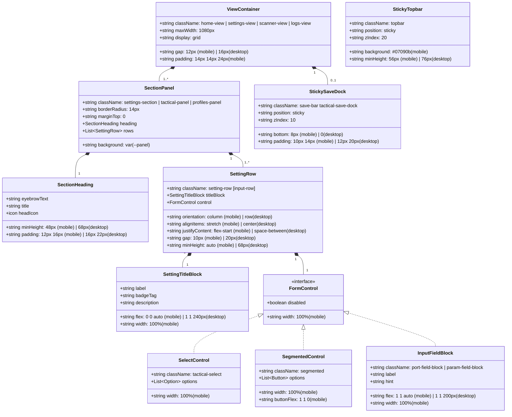

# Phase 1 Data Model: Mobile Layout & Spacing Architecture

**Feature Directory**: `specs/009-fix-android-spacing`  
**Date**: 2026-09-18  
**Status**: Completed  

---

## 1. Conceptual Layout Entities & Hierarchy

Although this feature addresses UI presentation and CSS layout density, the layout system models structured relationships between View Containers, Section Panels, Setting Rows, and Control Blocks.

---

## 2. Layout State Specifications

### A. Breakpoint Boundaries

| Breakpoint Range | Device Class | Primary Orientation | Flex Axis for `.setting-row` |
| :--- | :--- | :--- | :--- |
| $\le 680\text{px}$ | Mobile (Android / Small Viewport) | Portrait | `column` (Vertical) |
| $> 680\text{px}$ | Desktop / Tablet Landscape | Landscape / Wide | `row` (Horizontal) |

### B. Mobile Layout Attributes per Component

#### 1. `.topbar` (Sticky Header)
- **Position**: `sticky`
- **Top**: `0`
- **Background**: `#07090b !important` (100% opaque, masks scrolled cards)
- **Min Height**: `56px` (decreased from 72px–76px)
- **Padding**: `calc(10px + env(safe-area-inset-top, 0px)) 16px 10px`
- **Z-Index**: `20`

#### 2. `.home-view, .settings-view, .logs-view, .scanner-view` (View Containers)
- **Padding**: `14px 14px 24px`
- **Grid Gap**: `12px` (reduced from 16px)
- **Max Width**: `min(100%, 1080px)`

#### 3. `.tactical-panel, .settings-section, .profiles-panel` (Card Panels)
- **Margin Top**: `0` (eliminates duplicate 16px spacing in grid containers)
- **Border Radius**: `14px`
- **Border**: `1px solid var(--border-card)`
- **Background**: `var(--panel)`

#### 4. `.section-heading` (Card Headers)
- **Min Height**: `48px` (reduced from 68px)
- **Padding**: `12px 16px` (reduced from 16px 22px)

#### 5. `.setting-row` (Individual Setting Item)
- **Display**: `flex`
- **Flex Direction**: `column`
- **Align Items**: `stretch` (ensures child controls fill card width)
- **Justify Content**: `flex-start` (controls sit right below descriptions)
- **Gap**: `10px` (replaces 20px gap and 350px dead space)
- **Min Height**: `auto` (replaces 68px minimum)
- **Padding**: `14px 16px`

#### 6. `.setting-row > div:first-child` (Setting Label & Description Block)
- **Flex**: `0 0 auto` (replaces `1 1 240px` to stop vertical bloat)
- **Width**: `100%`
- **Min Width**: `0`

#### 7. `.port-field-block, .param-field-block` (Input Blocks)
- **Flex**: `1 1 auto` (replaces `1 1 200px`)
- **Width**: `100%`
- **Min Width**: `0`

#### 8. `.tactical-select` (Dropdowns)
- **Width**: `100%`
- **Min Width**: `0`
- **Height**: `36px`

#### 9. `.segmented` (Segmented Button Groups)
- **Width**: `100%`
- **Display**: `flex`
- **Button Flex**: `1 1 0`
- **Button Min-Width**: `0`
- **Button Justify**: `center`

#### 10. `.tactical-save-dock` (Floating Bottom Status Bar)
- **Position**: `sticky`
- **Bottom**: `8px`
- **Padding**: `10px 14px`
- **Border Radius**: `10px`
- **Background**: `rgba(9, 12, 15, 0.96)`

---

## 3. Validation Rules & Constraints

- **VR-001 (Zero Vertical Expansion)**: Under no circumstances shall `.setting-row > div:first-child` have a non-zero `flex-basis` when `flex-direction` is `column`.
- **VR-002 (Opaque Topbar)**: Topbar background on mobile must be solid `#07090b` with zero transparency (`rgba` alpha = 1.0).
- **VR-003 (Full Touch Targets)**: Every interactive element inside `.setting-row` (buttons, selects, segmented options) must maintain a minimum touch target height of $\ge 32\text{px}$ (preferably 36px).
- **VR-004 (Horizontal Stretch)**: Controls on mobile must occupy 100% of their container's available width (`width: 100%`).
