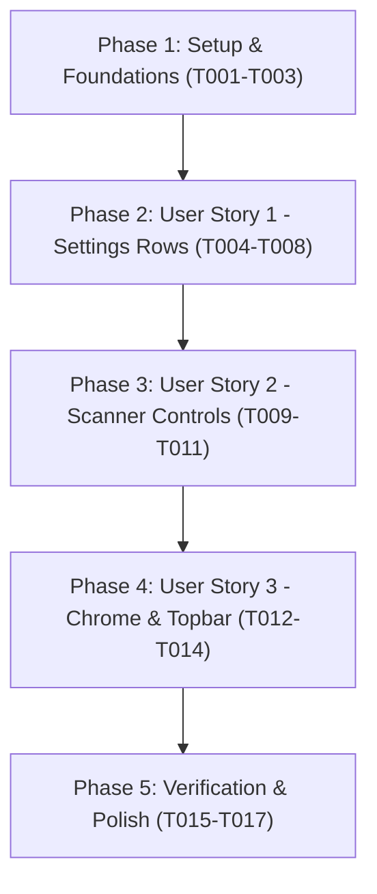

# Tasks: Android UI Spacing & Mobile Density Overhaul

**Feature Directory**: `specs/009-fix-android-spacing`  
**Date**: 2026-09-18  
**Plan**: [specs/009-fix-android-spacing/plan.md](file:///C:/Users/SLiM/Desktop/Project/Aether/specs/009-fix-android-spacing/plan.md)  
**Spec**: [specs/009-fix-android-spacing/spec.md](file:///C:/Users/SLiM/Desktop/Project/Aether/specs/009-fix-android-spacing/spec.md)  

---

## Phase 1: Setup & Foundational Prerequisites

**Purpose**: Baseline CSS cleanup and container margin de-duplication across both mobile and desktop stylesheets.

- [x] T001 Remove redundant `margin-top: 16px` on card panels (`.proxy-panel`, `.settings-section`, `.test-panel`, `.profiles-panel`) when inside grid containers in `apps/android/src/App.css` and `apps/desktop/src/App.css`
- [x] T002 Configure compact container padding (`14px 14px 24px`) and grid gap (`12px`) for `.home-view, .settings-view, .logs-view, .scanner-view` under `@media (max-width: 680px)` in `apps/android/src/App.css` and `apps/desktop/src/App.css`
- [x] T003 Tighten `.section-heading` card headers on mobile to `min-height: 48px; padding: 12px 16px;` in `apps/android/src/App.css` and `apps/desktop/src/App.css`

---

## Phase 2: User Story 1 - Compact, Proportionate Settings Rows & Panels (Priority: P1) 🎯 MVP

**Goal**: Eliminate 400px empty vertical voids in Settings tab cards (Topology Scanner, Android Routing, IP Pool Family, Proxy Endpoints), bringing controls immediately below labels.

**Independent Test**: Open Settings tab on mobile viewport ($\le 680\text{px}$). Verify each card displays label and interactive controls in an immediate vertical stack with 10px gap, reducing card height by $>50\%$.

- [x] T004 [US1] Reset `.setting-row > div:first-child` to `flex: 0 0 auto; width: 100%; min-width: 0;` under `@media (max-width: 680px)` in `apps/android/src/App.css` and `apps/desktop/src/App.css`
- [x] T005 [US1] Update `.setting-row` to `align-items: stretch; flex-direction: column; justify-content: flex-start; gap: 10px; min-height: auto; padding: 14px 16px;` under `@media (max-width: 680px)` in `apps/android/src/App.css` and `apps/desktop/src/App.css`
- [x] T006 [US1] Add `.port-field-block` to mobile responsive rules with `flex: 1 1 auto; width: 100%; min-width: 0;` alongside `.param-field-block` in `apps/android/src/App.css` and `apps/desktop/src/App.css`
- [x] T007 [US1] Set `.tactical-select` to `width: 100%; min-width: 0;` under `@media (max-width: 680px)` in `apps/android/src/App.css` and `apps/desktop/src/App.css`
- [x] T008 [US1] Set `.segmented` to `width: 100%;` and `.segmented button` to `flex: 1 1 0; min-width: 0; text-align: center; justify-content: center;` under `@media (max-width: 680px)` in `apps/android/src/App.css` and `apps/desktop/src/App.css`

**Checkpoint**: User Story 1 complete. Settings tab renders with tight, balanced, mobile-native density.

---

## Phase 3: User Story 2 - Compact, Balanced Scanner Controls & Telemetry Layout (Priority: P1)

**Goal**: Ensure Scanner tab controls, segmented protocol buttons, numeric parameter steppers, and telemetry cards stack cleanly with balanced mobile proportions.

**Independent Test**: Open Scanner tab on mobile viewport. Verify Target Protocol, IP Family, Concurrency Workers, and Timeout fields fit comfortably without bloated vertical gaps.

- [x] T009 [US2] Update `.setting-row.input-row` to `flex-direction: column; gap: 12px;` under `@media (max-width: 680px)` in `apps/android/src/App.css` and `apps/desktop/src/App.css`
- [x] T010 [US2] Compact `.radar-telemetry-banner` and `.radar-radar-scope` padding and sizing for mobile screens in `apps/android/src/App.css` and `apps/desktop/src/App.css`
- [x] T011 [US2] Ensure scanner action bar (`.scanner-action-bar .primary-cta`) has full mobile width and compact touch margins in `apps/android/src/App.css` and `apps/desktop/src/App.css`

**Checkpoint**: User Story 2 complete. Scanner tab fits within viewport with clear, accessible controls.

---

## Phase 4: User Story 3 - Sticky Header & Bottom Navigation Chrome Cleanliness (Priority: P2)

**Goal**: Eliminate text bleed-through behind sticky topbar when scrolling cards, and guarantee clean save dock clearance above the bottom navigation bar.

**Independent Test**: Vertically scroll through Settings and Scanner tabs. Verify topbar renders solid `#07090b` masking all scrolled content, and floating save dock never overlaps bottom navigation.

- [x] T012 [US3] Set `.topbar` background to `#07090b !important; min-height: 56px; border-bottom: 1px solid var(--border-card);` under `@media (max-width: 680px)` in `apps/android/src/App.css` and `apps/desktop/src/App.css`
- [x] T013 [US3] Adjust mobile topbar padding to `calc(10px + env(safe-area-inset-top, 0px)) 16px 10px !important;` in `apps/android/src/App.css`
- [x] T014 [US3] Style `.tactical-save-dock` on mobile with `position: sticky; bottom: 8px; margin-top: 12px; padding: 10px 14px; border-radius: 10px; background: rgba(9, 12, 15, 0.96);` in `apps/android/src/App.css`

**Checkpoint**: User Story 3 complete. Zero ghosting or bleed-through behind header, save dock cleanly docked.

---

## Phase 5: Verification & Polish

**Purpose**: End-to-end validation, build verification, and clean delivery.

- [x] T015 Run `npm run build` in `apps/android` to verify TypeScript and Vite compilation
- [x] T016 Run `npm run build` in `apps/desktop` to verify desktop parity and clean compilation
- [x] T017 Execute `quickstart.md` validation scenarios on simulated mobile screen (390px × 844px)

---

## Dependencies & Execution Order

