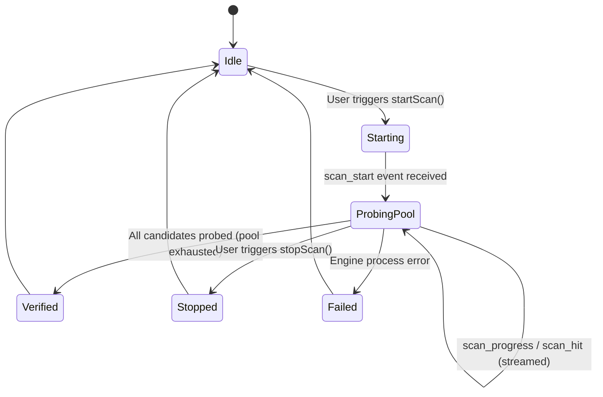
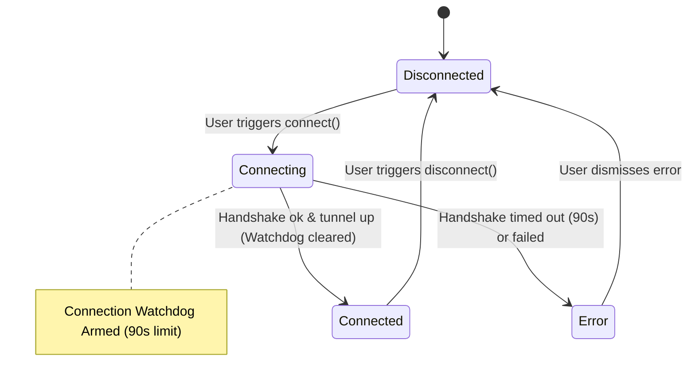

# Data Model: Unbounded Scanner Execution & Mobile Terminal Header UI Fixes

**Feature**: `012-fix-android-scanner-timeout-ui`
**Status**: Complete

## 1. Entities & Lifecycles

### A. Endpoint Scan Session (`ScanSession`)
Represents an exploratory candidate probing task running in standalone mode.

**Attributes**:
- `active: boolean` — True while candidate probing is in progress.
- `mode: string` — Prober strategy (`"balanced"`, `"turbo"`, `"thorough"`, etc.).
- `protocol: "masque-h3" | "masque-h2" | "wireguard"` — Target transport protocol.
- `ipVersion: "v4" | "v6" | "both"` — IP family filter.
- `concurrency: number` — Maximum concurrent in-flight probes.
- `timeoutMs: number` — Per-probe verification timeout (individual probe deadline).
- `scanned: number` — Count of candidates tested so far.
- `total: number` — Total candidates in the pool.
- `working: number` — Count of verified functional gateways found.
- `bestRtt: string | null` — Lowest round-trip time discovered.
- `phase: "Idle" | "Starting" | "Probing Pool" | "Verified" | "Stopped" | "Failed" | "Error"` — Human-readable state indicator.

**Lifecycle Invariants**:
- Standalone scan operations MUST NOT change `ConnectionSession.status` to `"connecting"`.
- Standalone scan operations MUST NOT arm the `ConnectionSession.watchdog`.
- The scan remains in `ProbingPool` until either all `total` candidates are probed or the user explicitly issues `stopScan()`.

---

### B. Connection Session (`ConnectionSession`)
Represents the state of the encrypted VPN tunnel connection and its health watchdog.

**Attributes**:
- `status: "disconnected" | "connecting" | "connected" | "error"` — Tunnel status.
- `detail: string` — Current phase or error description.
- `pid: number | null` — Engine process identifier.
- `endpoint: string | null` — Connected gateway IP:port.
- `watchdogArmed: boolean` — True only while `status === "connecting"`.
- `watchdogTimeoutMs: 90_000` — Fixed timeout to avoid lingering hung connection attempts.

---

### C. Terminal Header Chrome View (`TerminalHeaderView`)
Represents the presentation state of the live engine activity terminal header.

| Property | Desktop Viewport (> 680px) | Mobile Viewport (≤ 680px) |
|---|---|---|
| **Layout Mechanism** | Flexbox (`row`, `space-between`) | CSS Grid (`2 rows`, `controls telemetry` / `actions actions`) |
| **Window Controls** | Left aligned, inline dots + full title text | Top-left cell, ellipsis overflow protection |
| **Telemetry Counter** | Center aligned, full width text | Top-right cell, right aligned, `white-space: nowrap` |
| **Action Buttons** | Right aligned inline (`Follow`, `Copy`, `Clear`) | Bottom row, right-aligned, full width safe, minimum 32px height |
| **Wrapping Behavior** | No wrapping | Zero vertical word stacking; actions drop to row 2 |

---

## 2. Event Contracts

### `session://state` (Tunnel State)
- Emitted when tunnel connection transitions (`disconnected`, `connecting`, `connected`, `error`).
- **MUST NOT** be emitted with `status: "connecting"` when `scan()` is called.

### `scan://event` (Scan Telemetry)
- `scan_start`: `{ type: "scan_start", mode: string, total: number, concurrency: number }`
- `scan_progress`: `{ type: "scan_progress", scanned: number, total: number, working: number }`
- `scan_hit`: `{ type: "scan_hit", addr: string, rtt: string, rttMs: number, protocol: string }`
- `scan_done`: `{ type: "scan_done", addr: string, rtt: string, protocol: string }`
- `scan_failed`: `{ type: "scan_failed", message: string }`
