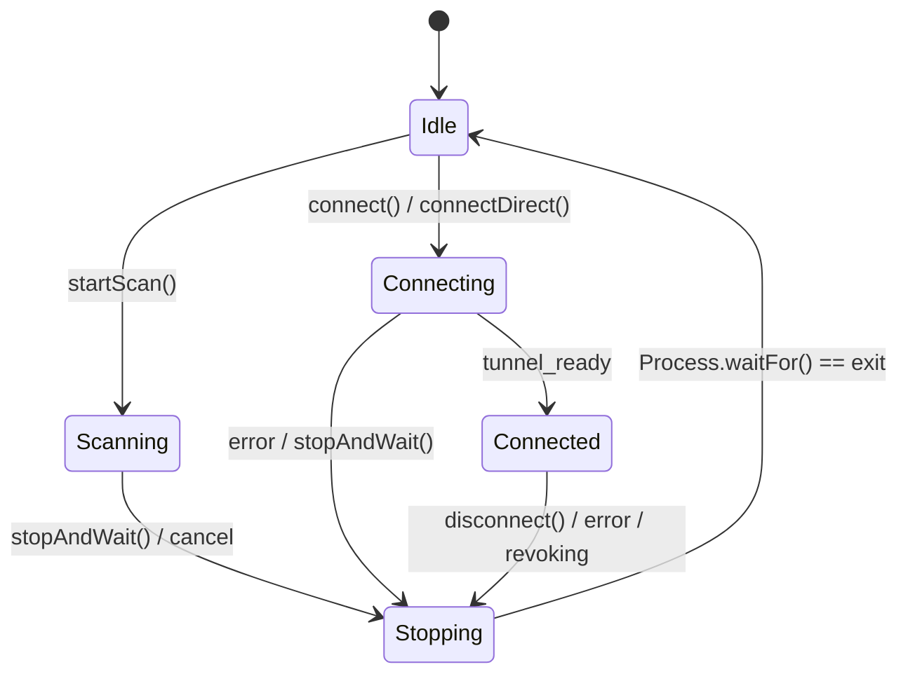

# Data Model: Security, Reliability & Quality Entities

**Feature**: `013-security-reliability-remediation`
**Date**: 2026-09-19

---

## 1. Process Supervisor State Machine (Android & Desktop)

Represents the execution lifecycle and process isolation barriers of the background networking engine.

### State Transitions



### Fields

| Field | Type | Description | Invariant |
|---|---|---|---|
| `state` | `SupervisorState` | Current lifecycle phase (`IDLE`, `SCANNING`, `CONNECTING`, `CONNECTED`, `STOPPING`) | Only one active non-idle state per supervisor instance. |
| `generation` | `Int64` | Monotonically increasing generation token | Increments on every `start`, `startScan`, and `stopAndWait` call. Callbacks from prior generations are discarded. |
| `pid` | `Int64?` | Operating system process identifier of running `aether` binary | `null` when `IDLE` or `STOPPING`. Positive integer when active. |
| `activeMode` | `EngineMode` | `NONE`, `STANDALONE_SCAN`, `TUNNEL` | Direct connections check `activeMode`; if `STANDALONE_SCAN`, automatically triggers `stopAndWait()`. |
| `processRef` | `Process?` | Native OS process handle | Cleared only after confirmed process termination. |

---

## 2. Identity Store & Encryption Envelope

Represents the persistent client credentials on Windows desktop and Android.

### Windows DPAPI Envelope Schema (`config_key.dpapi`)

```text
+-------------------------------------------------------------+
| Header (4 bytes): "DP01"                                    |
+-------------------------------------------------------------+
| Ciphertext: Output from CryptProtectData(32-byte master key)|
+-------------------------------------------------------------+
```

### Persisted Encrypted Identity File (`aether.toml`)

```text
+-------------------------------------------------------------+
| Magic (11 bytes): "AETHERCFG1\n"                             |
+-------------------------------------------------------------+
| Nonce (12 bytes): Cryptographically secure random bytes     |
+-------------------------------------------------------------+
| Ciphertext: ChaCha20-Poly1305 encrypted payload             |
| Decrypted: UTF-8 encoded TOML (PersistedIdentity)           |
+-------------------------------------------------------------+
| Poly1305 Auth Tag (16 bytes) appended to ciphertext         |
+-------------------------------------------------------------+
```

### Invariants:
- On Windows desktop, when `AETHER_CONFIG_KEY` is present, writing unencrypted plaintext to `aether.toml` is strictly forbidden.
- On startup, if `aether.toml` begins without `AETHERCFG1\n`, the engine reads the legacy plaintext, writes `aether.toml.bak`, encrypts the payload, writes to `aether.toml.tmp`, and uses `ReplaceFileW` to atomically commit the encrypted file before removing the backup.

---

## 3. Concurrency Guard (`ProvisionGuard`)

Manages mutual exclusion during initial device provisioning and registration across processes.

### File Entity: `aether.toml.lock`

| Field | Type | Description | Invariant |
|---|---|---|---|
| `fileHandle` | `File` | Open OS file handle with active exclusive lock | OS kernel releases lock immediately if process terminates or crashes. |
| `ownerPid` | `u32` | Process identifier of the lock holder | Checked for liveness via OS process inspection if lock is contended. |
| `acquiredAt` | `Instant` | Monotonic timestamp of acquisition | Heartbeat refreshed every 5 seconds during long provisioning flows. |
| `status` | `GuardStatus` | `HELD`, `RELEASED` | Never fails open: operations failing to acquire the lock abort with retryable error. |

---

## 4. Settings Validation Schema (Android Native Boundary)

Strictly defines valid ranges and enum sets accepted across the `AetherBridge`.

```json
{
  "$schema": "http://json-schema.org/draft-07/schema#",
  "title": "AetherSettings",
  "type": "object",
  "required": ["protocol", "transport", "scanMode", "ipVersion", "routingMode", "socksPort", "httpPort"],
  "properties": {
    "protocol": {
      "type": "string",
      "enum": ["wireguard", "masque"]
    },
    "transport": {
      "type": "string",
      "enum": ["h2", "h3"]
    },
    "scanMode": {
      "type": "string",
      "enum": ["turbo", "balanced", "thorough", "stealth", "ironclad"]
    },
    "ipVersion": {
      "type": "string",
      "enum": ["v4", "v6", "both"]
    },
    "noize": {
      "type": "string",
      "enum": ["off", "light", "medium", "high", "max", "custom"]
    },
    "routingMode": {
      "type": "string",
      "enum": ["tun", "proxy-only", "system-proxy"]
    },
    "socksPort": {
      "type": "integer",
      "minimum": 1024,
      "maximum": 65535
    },
    "httpPort": {
      "type": "integer",
      "minimum": 1024,
      "maximum": 65535
    },
    "quicInitialFragSize": {
      "type": "integer",
      "minimum": 16,
      "maximum": 512
    }
  }
}
```

### Invariants:
- `socksPort != httpPort`.
- Reject any setting object containing undefined properties or unlisted enum values.
