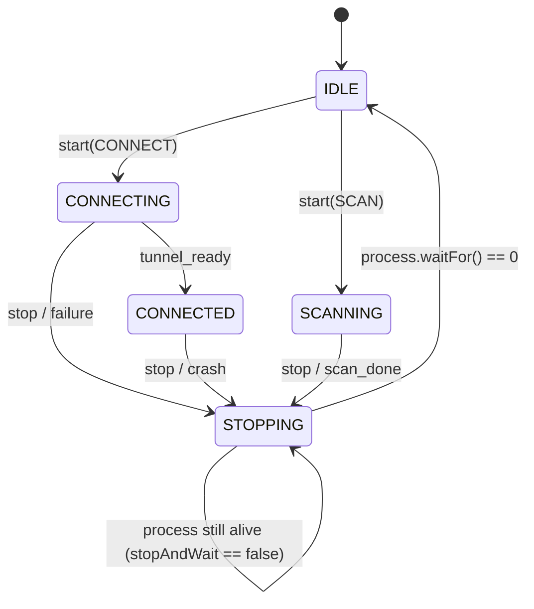

# Data Model: Audit Remediation Hardening & Verification Completeness

## Core Entities & Schemas

### 1. TrustedBinaryPolicy
Defines the verification constraints enforced on elevated desktop binaries prior to execution.

```rust
pub struct TrustedBinaryPolicy {
    pub allow_unsigned_in_debug: bool,
    pub expected_publisher_cn: &'static str,
    pub embedded_hashes: &'static [(&'static str, &'static str)],
    pub enforce_hash_match: bool,
}
```

#### Policies:
- **Engine Policy (`for_engine`)**:
  - `expected_publisher_cn`: `"deathline94"`
  - `allow_unsigned_in_debug`: `true` (debug only)
  - `enforce_hash_match`: `true` in release builds
- **Wintun Policy (`for_wintun`)**:
  - `expected_publisher_cn`: `"WireGuard LLC"`
  - `allow_unsigned_in_debug`: `false` (never allowed unsigned)
  - `enforce_hash_match`: `true` in release builds

---

### 2. CanonicalSettingsSchema
Unified configuration schema shared between TypeScript UI and Kotlin native validation.

| Field | Type | Valid Values / Constraints | Default |
|---|---|---|---|
| `endpointPreset` | String | `"warp"`, `"gool"` | `"warp"` |
| `noiseMode` | String | `"off"`, `"light"`, `"medium"`, `"high"`, `"max"`, `"custom"` | `"off"` |
| `transport` | String | `"h2"`, `"h3"` | `"h3"` |
| `protocol` | String | `"wireguard"`, `"masque"` | `"masque"` |
| `routingMode` | String | `"tun"`, `"proxy-only"`, `"system-proxy"` | `"tun"` |
| `ipVersion` | String | `"v4"`, `"v6"`, `"both"` | `"v4"` |
| `scanMode` | String | `"turbo"`, `"balanced"`, `"thorough"`, `"stealth"`, `"ironclad"` | `"balanced"` |
| `proxyPort` | Integer | `1024..65535` | `8086` |
| `scanTimeoutMs` | Integer | `Math.max(3000, timeout)` standard / `Math.max(6000, timeout)` H3 | `6000` |

---

### 3. SupervisorState Machine (EngineRunner)
Maintains strict mutual exclusion over the background engine process.



#### Invariant:
- While `process.isAlive()` is true, `state` **MUST** remain `STOPPING`, `running` **MUST** remain `true`, and `process` reference **MUST NOT** be nulled out.

---

### 4. Windows Proxy Recovery Snapshot
Captured registry state before modifying system proxy settings.

```json
{
  "enable": 0,
  "server": "127.0.0.1:8086",
  "override_": "<local>;*.internal"
}
```

#### Read-Back Validation Table:
| Snapshot Field | Snapshot Value | Read-Back Requirement |
|---|---|---|
| `enable` | `1` | Registry `ProxyEnable == 1` |
| `enable` | `0` | Registry `ProxyEnable == 0` |
| `server` | `Some(s)` | Registry `ProxyServer` exists AND equals `s` |
| `server` | `None` | Registry `ProxyServer` does not exist OR is empty string |
| `override_` | `Some(o)` | Registry `ProxyOverride` exists AND equals `o` |
| `override_` | `None` | Registry `ProxyOverride` does not exist OR is empty string |

---

### 5. Scanner Generation Token
Binds cooperative cancellation tokens to a monotonically increasing scan generation counter.

```rust
pub struct ScanSession {
    pub generation: u64,
    pub token: CancellationToken,
}
```
- When cancellation is triggered for generation `G`, all probe futures for `G` abort immediately.
- Starting a new scan increments `generation`, creating a fresh token, ensuring early cancellation of generation `G` is not wiped by generation `G+1` setup.
